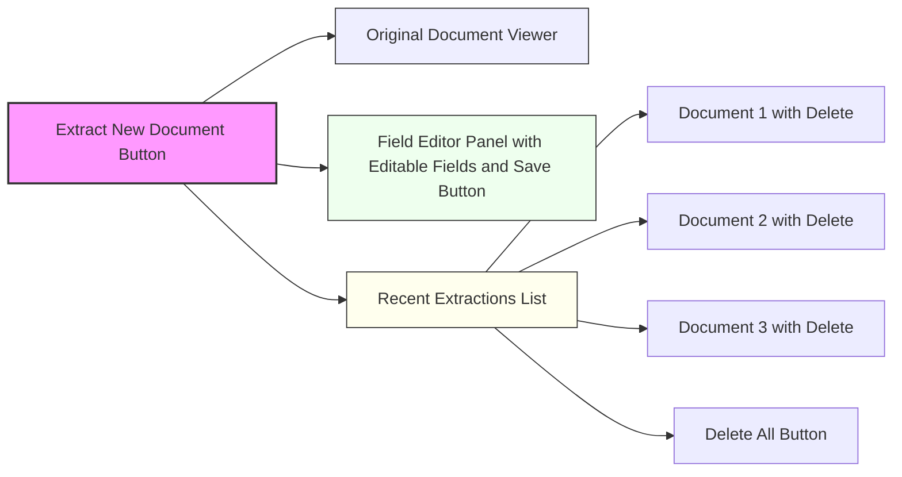
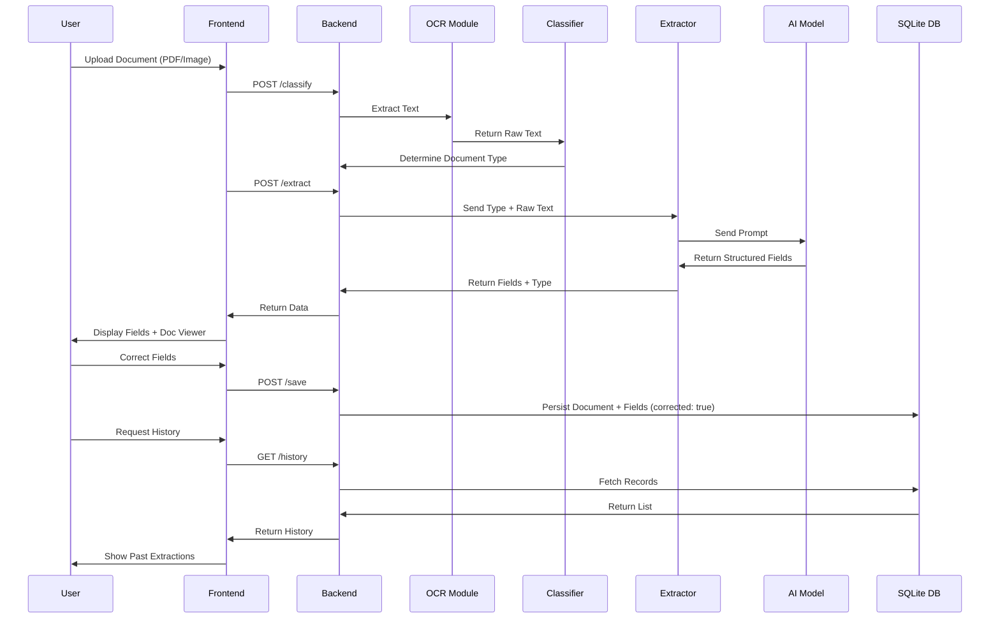
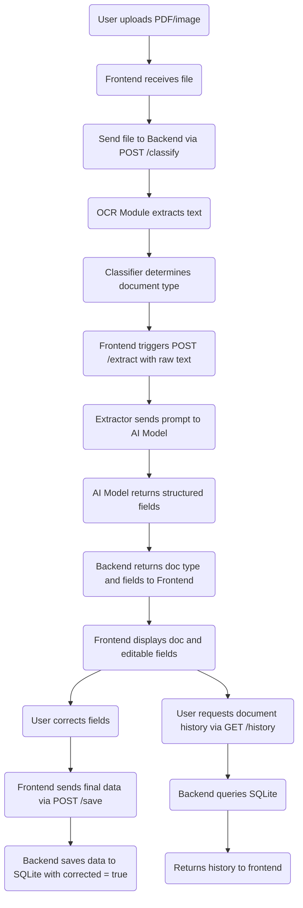

# Casium Immigration Document Scanner

## Functional Requirements
- Support uploading of both PDF and image documents
- Classify document types: Passport, Driver License, EAD Card
- Extract specific fields per document type
- Provide editable UI for manual correction of extracted fields
- Persist document metadata and field values in SQLite
- Support deletion of individual and all documents
- Provide a UI to view historical document processing

## Non-Functional Requirements
- Use FastAPI for backend with clear modular structure
- Use React + TypeScript for frontend with reusable components
- Ensure quick turnaround (~16 hours max) using AI-assisted tools
- Use SQLAlchemy ORM for database persistence
- Ensure readable, maintainable code with separation of concerns
- Follow best practices for model prompting and field standardization
- Optimize for ease of testing and iterative improvement

## Overview
This project implements a full-stack application to classify and extract key data fields from U.S. immigration-related documents using OCR and AI-assisted processing. It includes a FastAPI backend, a React + TypeScript frontend, and a lightweight SQLite database. The system is designed to be modular, testable, and easy to expand or deploy.

## Architecture

### High-Level Architecture

```mermaid
graph TD
  User -->|Uploads Document| Frontend
  Frontend -->|Sends to API| Backend
  Backend --> OCR[OCR Module (Tesseract)]
  OCR --> Classifier[Classifier Module]
  Classifier --> Extractor[Extractor Module]
  Extractor --> AI[AI Model (GPT-4)]
  AI --> Extractor
  Extractor --> Backend
  Backend --> DB[(SQLite Database)]
  Backend --> Frontend
  Frontend -->|Display Fields| User
```

### Backend (Python / FastAPI)

**Responsibilities:**
- Receive file uploads (PDF, image)
- Perform OCR and document classification
- Extract fields based on document type
- Serve API for frontend integration
- Persist documents and user edits

**Folder Structure:**
```
backend/
├── main.py              # Entrypoint
├── api/
│   └── endpoints.py     # FastAPI routes
├── services/
│   ├── classifier.py    # Document classification logic
│   └── extractor.py     # Field extraction logic
├── models/
│   ├── schemas.py       # Pydantic models
│   └── db_models.py     # SQLAlchemy ORM models
├── db/
│   ├── session.py       # Database session setup
│   └── crud.py          # DB access logic
├── utils/
│   ├── ocr.py           # OCR wrapper
│   └── ai.py            # GPT/LLM wrappers
└── requirements.txt
```

**Key Endpoints:**

| Method | Path           | Functionality                                                                 |
|--------|----------------|------------------------------------------------------------------------------|
| POST   | /classify      | Trigger OCR and classify document type (e.g., passport, DL, EAD). If using GPT-4 Vision, the image can be sent directly for combined classification and field extraction. |
| POST   | /extract       | Extract fields from the document. Assumes OCR and classification are already done (e.g., following /classify). Accepts raw text + doc type and returns structured fields. |
| GET    | /history       | Fetch recent documents                                                        |
| POST   | /save          | Save extracted fields                                                         |
| DELETE | /document/:id  | Delete a single document                                                      |
| DELETE | /documents     | Delete all documents                                                          |

### Frontend (React + TypeScript)

**Responsibilities:**
- Upload documents
- Display extracted fields
- Allow field correction
- View historical extractions
- Delete individual documents
- Delete all documents

**UI Diagram (Mermaid)**


**Folder Structure:**
```
frontend/
├── src/
│   ├── App.tsx
│   ├── components/
│   │   ├── UploadForm.tsx
│   │   ├── DocumentViewer.tsx
│   │   ├── FieldEditor.tsx
│   │   ├── HistorySidebar.tsx
│   │   └── DeleteButton.tsx
│   ├── pages/
│   ├── api/
│   └── utils/
└── package.json
```

### Database (SQLite + SQLAlchemy)

**Schema:**
```
Document
---------
id              PK
filename        str
document_type   str
created_at      datetime

ExtractedField
--------------
id              PK
document_id     FK
field_name      str
field_value     str
corrected       bool  # e.g., corrected = true if user manually edits the extracted value
```

This schema allows tracking which fields were modified by users, improving accuracy auditing and feedback collection.

## AI Integration

| Task           | Tool                         |
|----------------|------------------------------|
| OCR            | pytesseract / Google Vision  |
| Classification | GPT-4 Vision / Prompt Engine |
| Field Extraction| GPT-4 w/ templated prompt    |

## User Flow

> Note: This section is split into two flows — one for document classification & extraction, and one for history retrieval. Each endpoint is triggered separately by the frontend.

### Sequence Diagram



### Flowchart



## Handling Ambiguity and Fuzzy Data

### Name Field Disambiguation
- Use GPT-4 prompt to split full name into `first_name` and `last_name`
- Apply heuristics (e.g. comma-separated names or 2-token names)
- Optional fallback: use Python `nameparser` to assist parsing

```python
from nameparser import HumanName
name = HumanName("John Smith")
name.first  # 'John'
name.last   # 'Smith'
```

### Date Format Normalization
- Infer format from document type and issuing country (e.g., MM/DD/YYYY for U.S. docs)
- Normalize all date strings to ISO format (`YYYY-MM-DD`) using `dateutil.parser`

```python
from dateutil import parser
dob = parser.parse("03/04/1990", dayfirst=False).strftime("%Y-%m-%d")
```

### Test Case Construction
- Use synthetic documents with labeled fields
- Fuzz test input with swapped fields, blurred images, or date format inconsistencies
- Evaluate field extraction using precision, recall, and edit distance (Levenshtein)

## Model Selection Rationale

| Model                  | Use Case                  | Why Use It?                                |
|------------------------|---------------------------|---------------------------------------------|
| GPT-4 Vision           | Classification + Fields   | Easy, accurate, robust to fuzzy layouts     |
| Azure Form Recognizer  | OCR-heavy extraction      | Pre-tuned for ID docs, but limited control  |
| Tesseract + GPT-4 Text | Fast OCR + smart parsing  | Good balance of speed and flexibility       |

Final approach uses **pytesseract + GPT-4 (text prompt)**:
- No training required
- Easy to iterate and refine with examples
- Can adapt to many document layouts and fuzzy text

## Testing Strategy
- Use sample image and PDF documents for each type
- Validate:
  - OCR text quality
  - Classification accuracy
  - Field extraction precision
- Test API responses via Swagger UI or Postman

## Future Enhancements
- Support more document types
- Add authentication for multi-user support
- Add versioning for corrected fields
- Export field values as CSV/JSON
- Deploy with Docker + Nginx

## Authors
- Jerrick Lewis — Engineer and Architect for this implementation

This design is optimized for a 16-hour take-home evaluation window while being extensible for production scenarios.