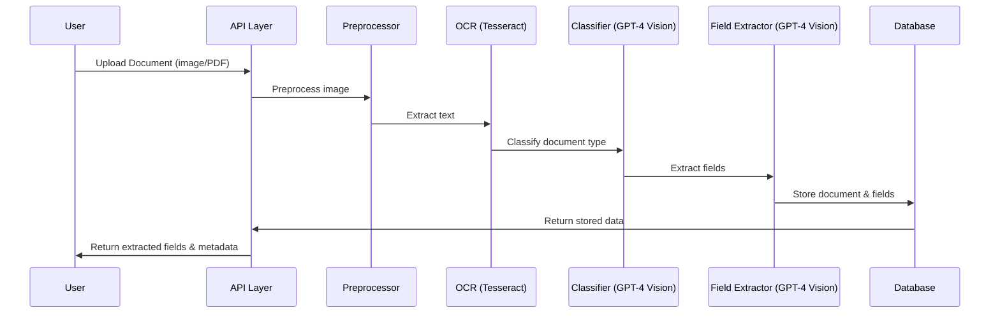
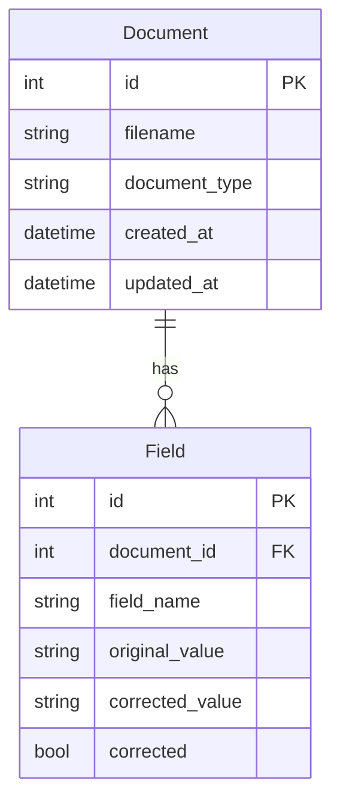

[⬅️ Main Design Doc](./Document%20Scanner%20Design.md)

# Backend Design

## Overview
This document provides a detailed technical overview of the backend for the Document Scanner project, including architecture, module responsibilities, database schema, error handling, and testing strategy.

## Architecture & Pipeline
The backend processes documents through a series of well-defined steps, from upload to data persistence and response.

## Module & File Breakdown
Each backend module has a clear responsibility in the pipeline. Below is a summary of the main files and their roles:

- **main.py**: Entrypoint for the FastAPI app. Sets up API, middleware, and logging.
- **app/api/endpoints.py**: Defines REST API routes for document upload, retrieval, update, and deletion. Handles request validation and response formatting.
- **app/services/classifier.py**: Contains logic for classifying document types using OCR (Tesseract) and GPT-4 Vision. Receives preprocessed images and returns the predicted type.
- **app/services/extractor.py**: Implements field extraction logic, using AI to extract key-value pairs from the document image or text.
- **app/services/document_processor.py**: Orchestrates the end-to-end document processing pipeline, calling preprocessing, classification, and extraction modules in sequence.
- **app/models/schemas.py**: Defines Pydantic models for request/response validation and serialization.
- **app/models/db_models.py**: SQLAlchemy ORM models for persisting documents and extracted fields in the database.
- **app/db/session.py**: Sets up the database connection and session management.
- **app/db/crud.py**: Implements database access logic (CRUD operations) for documents and fields.
- **app/utils/ocr.py**: Wraps Tesseract OCR and provides text extraction utilities, including preprocessing and validation.
- **app/utils/ai.py**: Contains wrappers for calling AI models (e.g., GPT-4 Vision) and formatting prompts for classification and extraction.
- **app/utils/pdf_processor.py**: Utilities for handling PDF files, such as page extraction and conversion to images.
- **app/utils/field_mapping.py**: Maps extracted fields to standardized schema fields for each document type.
- **app/preprocess_image.py**: Main image preprocessing logic, used before OCR/AI extraction (auto-orient, resize, enhance, save as PNG).
- **uploads/**: Stores uploaded files for processing and audit.

## Database Schema
The backend uses a normalized schema to store documents and their extracted fields. This enables efficient queries and historical audits.

## Error Handling & Logging
Robust error handling and logging are implemented at every major step:
- All major steps log errors and warnings to the `logs/` directory.
- If OCR or AI extraction fails, the API returns a user-friendly error message and logs the stack trace for debugging.
- Database connection issues are logged and surfaced as backend errors.
- Image preprocessing failures prompt the user to retry with a better image.

## Testing Strategy
Automated tests ensure backend reliability and maintainability:
- Unit tests for each module (pytest)
- Integration tests for API endpoints (pytest + httpx)
- Test coverage includes edge cases, error handling, and user correction scenarios

## Implementation Notes
- The system extracts different fields based on document type:
  - **Passport**: document number, full name, nationality, date of birth, expiration date
  - **Driver's License**: license number, name, address, date of birth, expiration date
  - **EAD Card**: alien number, name, country of birth, expiration date, category
- Database schema:
  - `Document`: Stores document metadata and binary content
  - `ExtractedField`: Stores individual extracted fields with correction history 