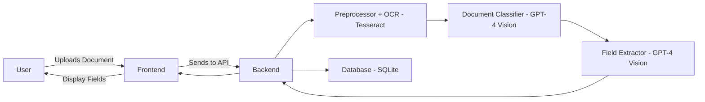
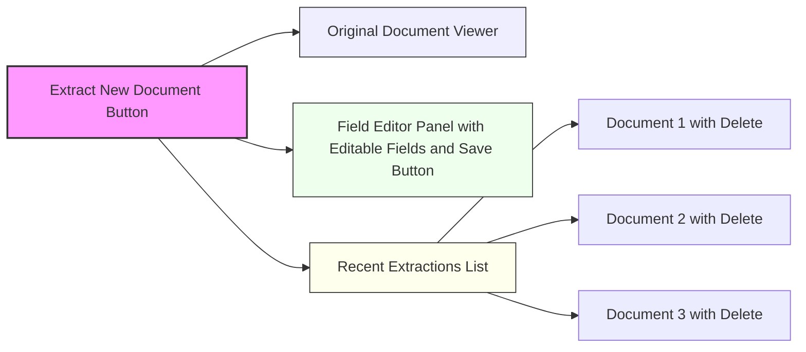
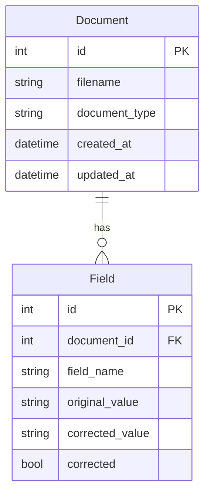
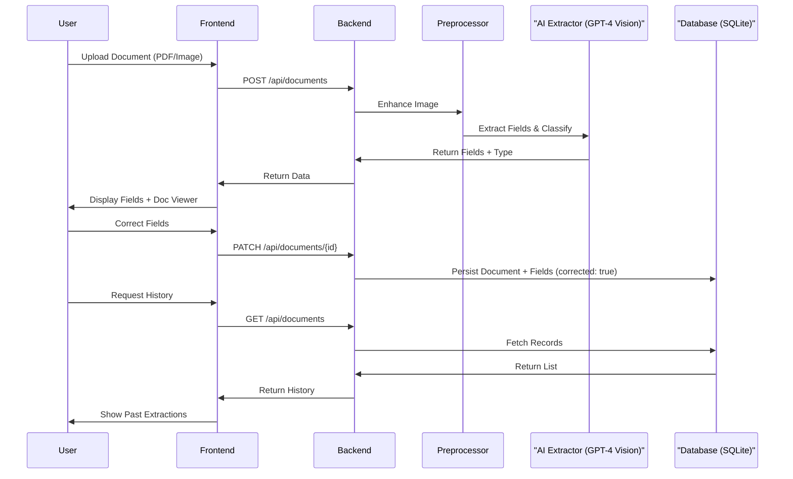
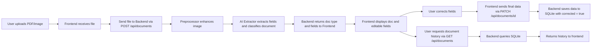

[�� Backend Design](./Backend%20Design.md) | [🖥️ Frontend Design](./Frontend%20Design.md)

# Casium Immigration Document Scanner

## Functional Requirements
- Support uploading of both PDF and image documents
- Classify document types: Passport, Driver License, EAD Card
- Extract specific fields per document type
- Provide editable UI for manual correction of extracted fields
- Persist document metadata and field values in SQLite
- Support deletion of individual documents
- Provide a UI to view historical document processing

## Non-Functional Requirements
- Use FastAPI for backend with clear modular structure
- Use React + TypeScript for frontend with reusable components
- Use SQLAlchemy ORM for database persistence
- Ensure readable, maintainable code with separation of concerns
- Follow best practices for model prompting and field standardization
- Optimize for ease of testing and iterative improvement
- Use Material UI for frontend components

## Overview
This project implements a full-stack application to classify and extract key data fields from U.S. immigration-related documents using OCR and AI-assisted processing. It includes a FastAPI backend, a React + TypeScript frontend, and a lightweight SQLite database. The system is designed to be modular, testable, and easy to expand or deploy.

## Architecture

### High-Level Architecture



### Backend (Python / FastAPI)

**High-Level Overview:**
- The backend is responsible for receiving document uploads, preprocessing images (including OCR with Tesseract), classifying document types, extracting key fields, and storing results in a database.
- The processing pipeline is explicitly split into OCR, classification, and field extraction steps for clarity and easier debugging/testing.
- It exposes a RESTful API for the frontend to interact with, supporting upload, retrieval, update, and deletion of documents.
- The backend is organized into modules for API routing, document processing, AI integration, database management, and utility functions.

**Key Modules:**
- **API Layer:** Handles all HTTP requests and responses, routing them to the appropriate processing logic.
- **Processing Pipeline:** Orchestrates the flow from file upload through image preprocessing, OCR, AI-based classification, and field extraction.
- **OCR Module:** Uses Tesseract to extract raw text from images as an explicit preprocessing step.
- **Classifier:** Uses GPT-4 Vision to determine the document type.
- **Field Extractor:** Uses GPT-4 Vision to extract fields based on the determined type.
- **Database Layer:** Manages storage and retrieval of documents and extracted data using SQLAlchemy and SQLite.
- **Utilities:** Provides helper functions for PDF handling and image processing to support the main pipeline.

**Image Preprocessing Details:**
The backend performs several image preprocessing steps before sending the document to the AI extractor. These steps are implemented in `preprocess_image.py` and `utils/ocr.py`:

- **Grayscale Conversion:** Converts color images to grayscale to reduce noise and focus on text features.
- **Resizing:** Scales images to a standard resolution to ensure consistent input size for OCR/AI models.
- **Denoising:** Applies filters (e.g., Gaussian blur) to remove background noise and artifacts.
- **Thresholding/Binarization:** Converts the image to black and white, improving text contrast for OCR and AI extraction.
- **Orientation Correction:** Detects and corrects rotated or skewed images to maximize extraction accuracy.
- **Cropping:** Optionally crops borders or irrelevant regions to focus on the document area.

These preprocessing steps improve the quality of the extracted text and fields, reduce errors from poor scans or photos, and help the AI model generalize across different document layouts and image qualities.

**Key Endpoints:**

| Method | Path                      | Functionality                                                                 |
|--------|---------------------------|------------------------------------------------------------------------------|
| POST   | /api/documents            | Upload and process a document (PDF/image)                                    |
| GET    | /api/documents            | List all processed documents                                                 |
| GET    | /api/documents/{id}       | Get document details                                                         |
| PATCH  | /api/documents/{id}       | Update extracted fields                                                      |
| DELETE | /api/documents/{id}       | Delete a single document                                                     |

> Note: The endpoints `/classify`, `/extract`, `/save`, `/history` are now consolidated under `/api/documents` with RESTful semantics.

### Frontend (React + TypeScript)

**High-Level Overview:**
- The frontend provides a user-friendly interface for uploading documents, viewing and correcting extracted fields, and browsing document history.
- It communicates with the backend API to send files, receive extraction results, and manage document records.
- The frontend is built with reusable React components and uses Material UI for a modern look and feel.

**Key Components:**
- **App:** The main container that manages application state and coordinates data flow between components.
- **Upload & Validation:** Components for selecting, validating, and uploading documents.
- **Viewer & Editor:** Components for displaying the document and allowing users to review and correct extracted fields.
- **History:** Components for listing previously processed documents and viewing their details.
- **API Service:** Centralizes all communication with the backend, making it easy to manage and update API calls.

This modular structure ensures the system is easy to maintain, extend, and test, while providing a seamless experience for end users.

**UI Diagram (Mermaid)**


> **Note:** The colors in the diagram above are for visual grouping only and do not represent actual UI colors.

**Folder Structure:**
```
frontend/
├── src/
│   ├── App.tsx
│   ├── components/
│   │   ├── UploadForm.tsx
│   │   ├── DocumentViewer.tsx
│   │   ├── FieldEditor.tsx
│   │   ├── DocumentFields.tsx
│   │   ├── HistorySidebar.tsx
│   │   ├── DocumentHistory.tsx
│   │   ├── ImageResolutionValidator.tsx
│   │   └── DocumentUploader.tsx
│   ├── services/
│   │   └── api.ts
│   ├── types/
│   │   └── index.ts
│   ├── utils/
│   │   └── logger.ts
│   ├── App.test.tsx
│   └── index.tsx
├── public/
├── package.json
├── tsconfig.json
└── ...
```

### Database (SQLite + SQLAlchemy)

**Schema (Improved):**
```
Document
---------
id                  PK
filename            str
document_type       str
created_at          datetime
updated_at          datetime

Field
---------
id                  PK
document_id         FK
field_name          str
original_value      str
corrected_value     str (nullable)
corrected           bool
```

**ER Diagram (Mermaid):**


This schema simplifies queries, improves normalization, and makes historical audits easier.

### Image Preprocessing & User Feedback
- If an uploaded image fails preprocessing (e.g., too low resolution, unreadable), the user receives a clear error message and is prompted to retry with a better image.
- The frontend enforces and communicates minimum image quality standards (e.g., at least 500x300 pixels).

## AI Integration

| Task           | Tool                         |
|----------------|------------------------------|
| OCR            | pytesseract / Google Vision  |
| Classification | GPT-4 Vision / Prompt Engine |
| Field Extraction| GPT-4 w/ templated prompt    |

## User Flow

> Note: The frontend interacts with the backend via `/api/documents` endpoints for all document operations.

### Sequence Diagram



### Flowchart



## Handling Ambiguity and Fuzzy Data

### Name Field Disambiguation
- Use GPT-4 prompt to split full name into `first_name` and `last_name`
- Apply heuristics (e.g. comma-separated names or 2-token names)
- Optional fallback: use Python `