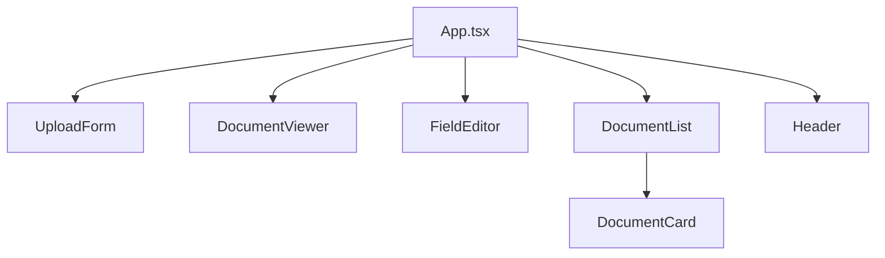
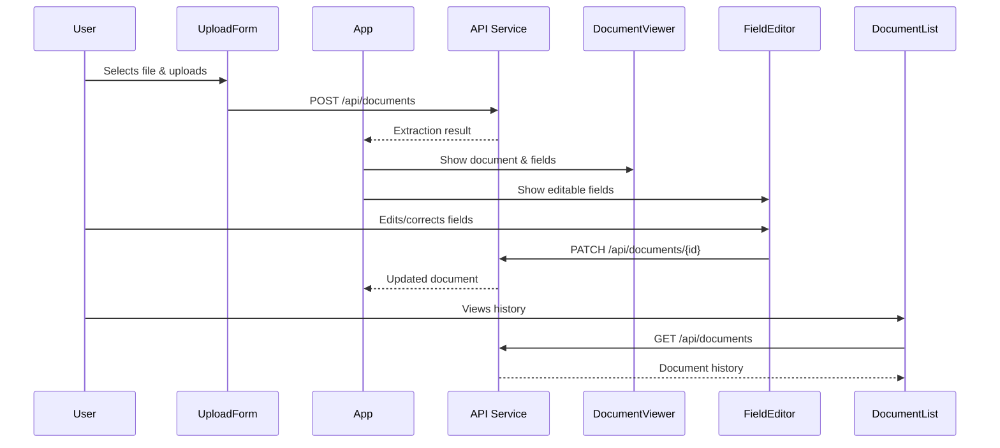

[⬅️ Project README](../README.md)

[⬅️ Main Design Doc](./Document%20Scanner%20Design.md)

# Frontend Design

## Component Hierarchy

## Main User Flow (Sequence Diagram)

## Component & File Breakdown

- [**App.tsx**](../frontend/src/App.tsx): Main application container. Manages global state (current document, history, loading/error states) and coordinates data flow between components.
- [**components/UploadForm/**](../frontend/src/components/UploadForm.tsx): Handles file selection and upload. Uses React Dropzone for drag-and-drop and validates file type/resolution before sending to backend.
- [**components/DocumentViewer/**](../frontend/src/components/DocumentViewer.tsx): Displays the uploaded document (image or PDF) and extracted fields. Supports zoom/pan and highlights fields.
- [**components/FieldEditor/**](../frontend/src/components/FieldEditor.tsx): Renders editable fields extracted from the document. Allows users to correct or confirm values before saving. Includes validation logic.
- [**components/DocumentList/**](../frontend/src/components/DocumentList.tsx): Shows a list of previously processed documents. Allows users to select and view past extractions or delete individual entries.
- [**components/DocumentCard/**](../frontend/src/components/DocumentCard.tsx): Displays summary info for a document in the history list.
- [**components/Header/**](../frontend/src/components/Header.tsx): Application header and navigation.
- [**services/api.ts**](../frontend/src/services/api.ts): Centralizes all API calls to the backend (upload, fetch, update, delete documents). Handles HTTP errors and response parsing.
- [**types/index.ts**](../frontend/src/types/index.ts): TypeScript type definitions for documents, fields, and API responses.
- Logging utility ([`utils/logger.ts`](../frontend/src/utils/logger.ts)) is used for debugging and error tracking.

## Data Flow & State Management

1. **Upload**: User uploads a document via UploadForm. File is validated and sent to backend.
2. **Display**: On response, App.tsx updates state and passes extracted fields to DocumentViewer and FieldEditor.
3. **Edit**: User can correct fields in FieldEditor, which updates state in App.tsx.
4. **Save**: Saving sends a PATCH request to the backend via api.ts.
5. **History**: DocumentList fetches and displays document history from the backend. Selecting a document loads its details.

- State is managed using React hooks and lifted to App.tsx for coordination between components.
- API errors and loading states are handled globally and surfaced to the user via UI feedback.

## Error Handling

- API errors are caught and displayed to the user with clear messages.
- File validation errors (type, size, resolution) are shown before upload.
- Logging utility ([`utils/logger.ts`](../frontend/src/utils/logger.ts)) is used for debugging and error tracking.

## Testing Strategy

- Component tests using React Testing Library
- Integration tests for API interactions
- End-to-end (e2e) tests for the full user flow
- Test coverage includes edge cases, error handling, and user correction scenarios 